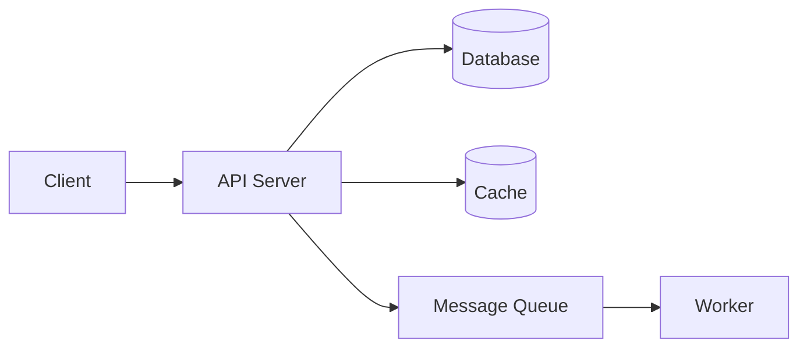
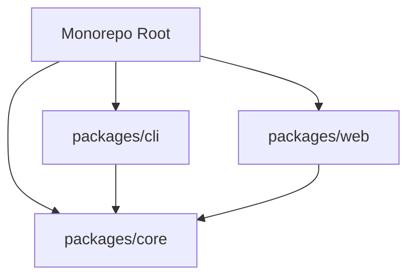
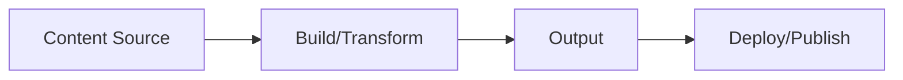
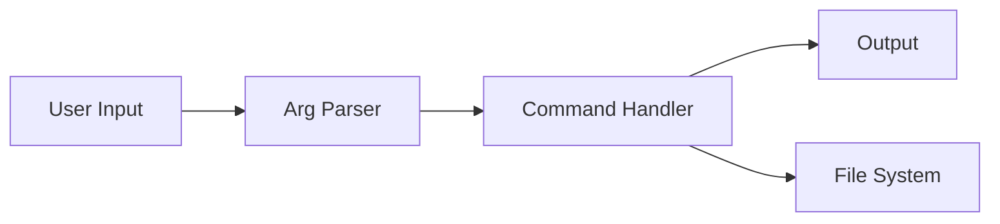
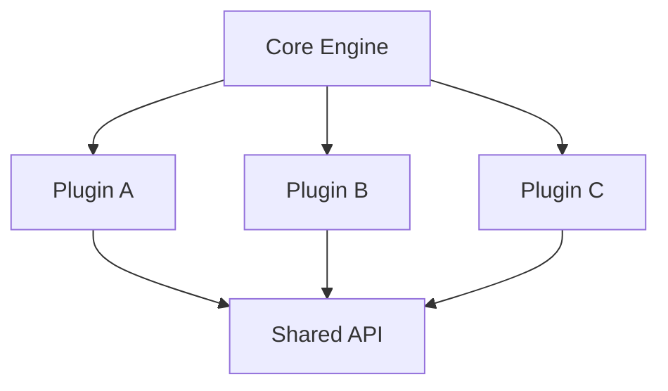

# Mermaid Diagram Templates

Use these as starting points when a project has multiple components or a clear data flow. Skip diagrams entirely for simple projects (single libraries, small CLIs, docs-only repos).

## API / Web App

## Monorepo

## Content Pipeline

## CLI Tool

## Plugin Architecture

---

Generate the diagram from the project's actual structure — adapt these templates, don't use them as-is.
